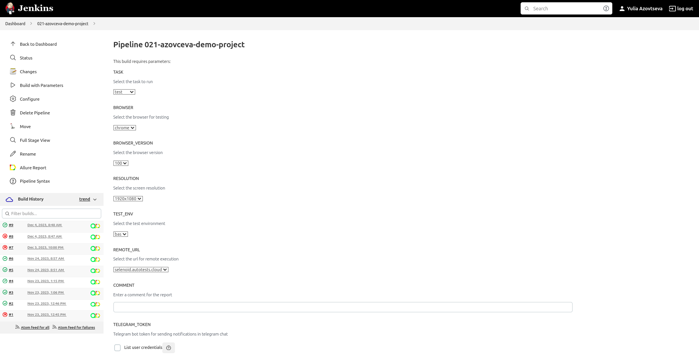
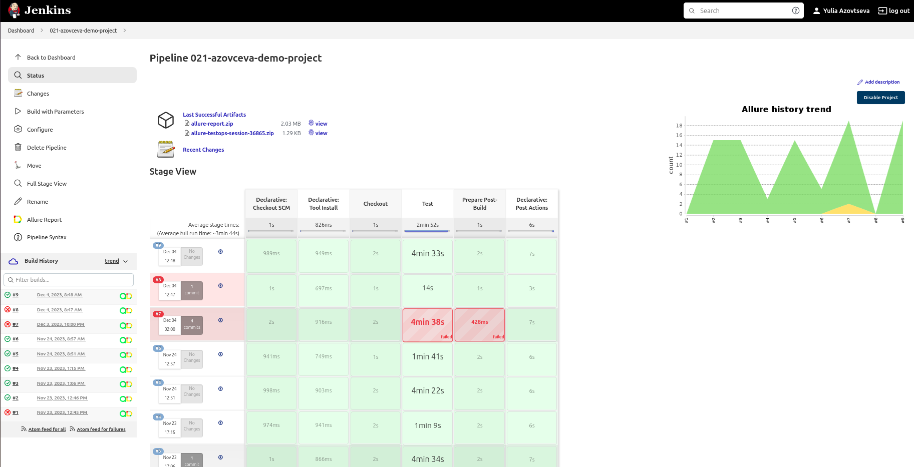
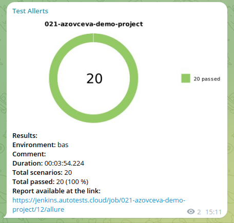

### About

Welcome to my demo Java test automation project designed for a web-based client-server analytics system. This system handles data related to buildings and other objects in the urban environment.

### Contents

- [Technologies and Tools](#tech-and-instruments)
- [Test Cases ](#tests)
- [Running Tests from Jenkins](#how-to-run)
- [Allure Report](#allure-report)
- [Report Artefacts](#test-artefacts)
- [Integration with Allure TestOps](#allure-test-ops)
- [Integration with Jira](#jira)
- [Allure Notifications](#telegram-notification)

### Technologies and Tools

`IntelliJ IDEA` for code writing and as a `Git` tool\
`Gradle` for build automation\
`JUnit5` for test execution\
`Selenide` for accelerated development based on `Selenium WebDriver`\
`REST Assured` for API testing\
`GitHub` for code storage\
`Jenkins` for remote test execution\
`Selenoid` for running browsers in `Docker` containers\
`Allure Report` for visualizing test results\
`Allure TestOps` for test management\
`Jira` for task management\
`Telegram` for test result notifications

### Test Cases

Login tests
1. Authenticate successfully with valid credentials
2. Successful user sign-out
3. Attempt login with empty password and username
4. Attempt login with an invalid password for a valid username

Objects list tests
1. Navigate to 'Objects' page from Main menu
2. Filter objects by level using 'Level' dropdown
2. Search by existing address using the upper 'Main Search' field
3. Search by existing address using the 'Sidebar Filter'
4. Search by a non-existing address using the upper 'Main Search' field

Create new object tests
1. Open 'New object' form from Objects page
2. Create a new object with all required fields properly filled
3. Create a new object with incomplete required fields

[↑ to contents](#contents)

----

### Running Tests from Jenkins

A task has been configured to run autotests with parameters in Jenkins.

Once the job is complete, you can get a summary of the test run and access the Allure report.

[↑ to contents](#contents)

----

### Allure Report

After the tests have passed, a graphical representation of the results is generated. Each test is presented in the report as a series of steps with readable names.

[↑ to contents](#contents)

----

### Report Artefacts
Detailed information, including snapshots, screenshots, and screen recordings for analyzing failed tests, is saved in the Allure Report.

Recording a video of test execution can help to identify any issues or errors that occur during the test run.

[↑ to contents](#contents)

----

### Integration with Allure TestOps
The integration between Jenkins and Allure works in both directions. Test results are collected in real-time from the build server during the execution of the build job. Additionally, tests can be initiated directly from the Allure interface. Manual and automated checks are combined into one test suite.

[↑ to contents](#contents)

----

### Integration with Jira
The Jira ticket is linked with tests from Allure TestOps.

[↑ to contents](#contents)

----

### Allure Notifications 
Using the Allure notifications library, automatic notifications about the test results are sent to Telegram (also works with Slack, Skype, Email, Mattermost, Discord, Loop).

[↑ to contents](#contents)

----